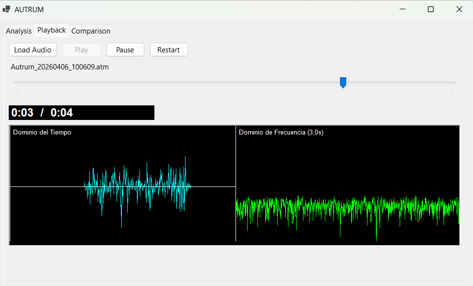
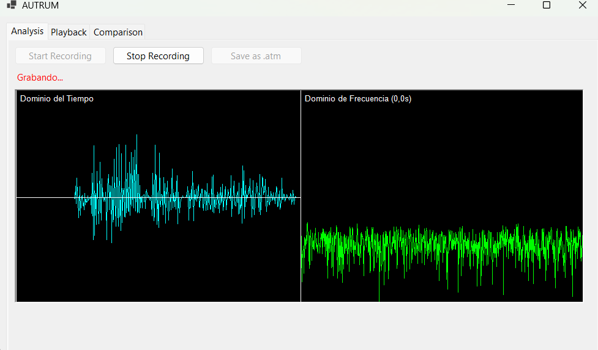
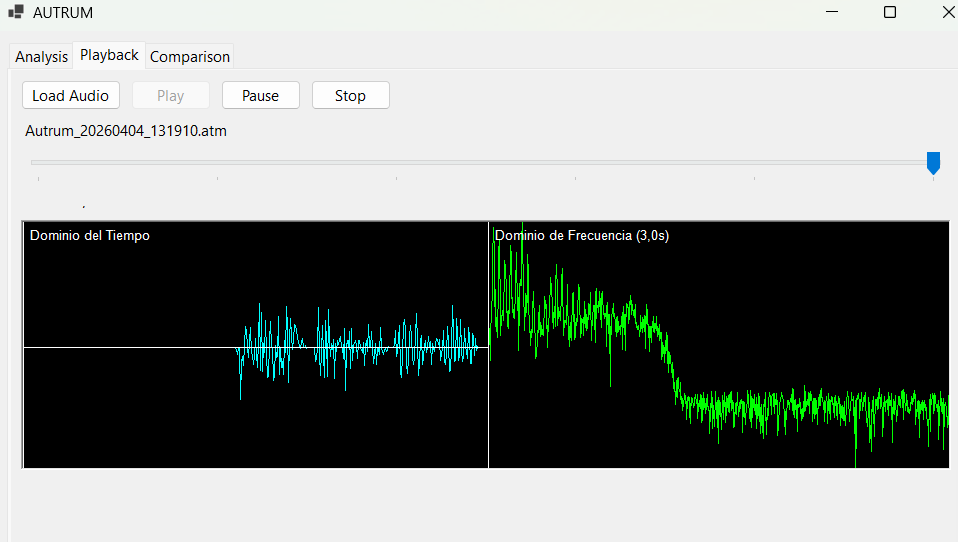
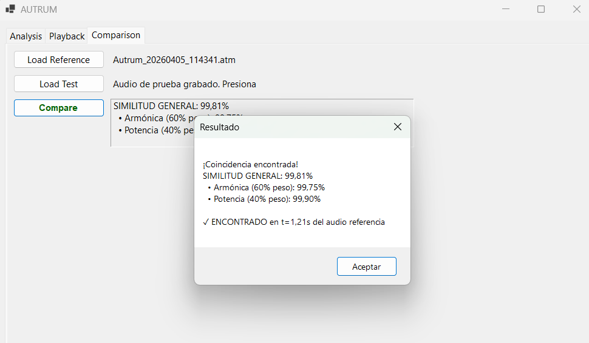

# Autrum - Sistema de Análisis y Comparación de Audio


**Fecha de entrega:** 06 de abril de 2026  
**Archivo:** `Documentacion.md`

**Integrantes:**
- Mariela Solano Gómez  
- Alejandra Delgado Pérez  
- Joshua Obando Castro  
- Roilin Navarro Vargas  
- Esteban Cortés

## Tabla de contenidos

- [Autrum - Sistema de Análisis y Comparación de Audio](#autrum---sistema-de-análisis-y-comparación-de-audio)
  - [Tabla de contenidos](#tabla-de-contenidos)
  - [1. Introducción](#1-introducción)
  - [2. Objetivos](#2-objetivos)
    - [2.1 Objetivo General](#21-objetivo-general)
    - [2.2 Objetivos Específicos](#22-objetivos-específicos)
  - [3. Descripción del Sistema](#3-descripción-del-sistema)
    - [3.1 Analizador](#31-analizador)
    - [3.2 Reproductor (Playback)](#32-reproductor-playback)
    - [3.3 Comparador](#33-comparador)
  - [4. Fundamentos Teóricos](#4-fundamentos-teóricos)
    - [4.1 Dominio del Tiempo](#41-dominio-del-tiempo)
    - [4.2 Dominio de la Frecuencia](#42-dominio-de-la-frecuencia)
    - [4.3 Transformada de Fourier (FFT)](#43-transformada-de-fourier-fft)
  - [5. Implementación Técnica](#5-implementación-técnica)
    - [5.1 Procesamiento de Audio](#51-procesamiento-de-audio)
    - [5.2 FFT](#52-fft)
    - [5.3 Búsqueda Temporal](#53-búsqueda-temporal)
  - [6. Métricas de Comparación](#6-métricas-de-comparación)
    - [6.1 Similitud Armónica](#61-similitud-armónica)
    - [6.2 Similitud de Potencia](#62-similitud-de-potencia)
    - [6.3 Similitud General](#63-similitud-general)
  - [7. Pruebas Realizadas](#7-pruebas-realizadas)
    - [7.1 Pruebas con Voz](#71-pruebas-con-voz)
    - [7.2 Pruebas con Tonos (400 Hz y 4000 Hz)](#72-pruebas-con-tonos-400-hz-y-4000-hz)
    - [7.3 Pruebas con Instrumentos Musicales](#73-pruebas-con-instrumentos-musicales)
    - [7.4 Observaciones](#74-observaciones)
  - [8. Resultados](#8-resultados)
  - [9. Limitaciones](#9-limitaciones)
  - [10. Conclusiones](#10-conclusiones)
  - [11. Respuestas](#11-respuestas)
    - [¿Por qué las voces de los integrantes son diferentes?](#por-qué-las-voces-de-los-integrantes-son-diferentes)
    - [¿Por qué la comparación de voces es poco exacta mediante armónicos?](#por-qué-la-comparación-de-voces-es-poco-exacta-mediante-armónicos)
  - [12. Recomendaciones](#12-recomendaciones)
  - [13. Repositorio](#13-repositorio)
  - [14. Guía de Ejecución de la tarea](#14-guía-de-ejecución-de-la-tarea)
    - [14.1 Requisitos Previos](#141-requisitos-previos)
    - [14.2 Instalación y Compilación](#142-instalación-y-compilación)
    - [14.3 Ejecución](#143-ejecución)
    - [14.4 Solución de Problemas](#144-solución-de-problemas)
    - [14.5 Tecnologías Utilizadas](#145-tecnologías-utilizadas)

##  1. Introducción

La presente tarea consiste en el desarrollo de una aplicación denominada Autrum, la cual permite analizar señales de audio utilizando la Transformada de Fourier, visualizar dichas señales en el dominio del tiempo y de la frecuencia, y comparar audios para determinar su nivel de similitud.

El sistema fue desarrollado con el objetivo de comprender el comportamiento de las señales y ondas, así como su representación matemática en el dominio de la frecuencia.


##  2. Objetivos

### 2.1 Objetivo General

Desarrollar una aplicación que permita analizar y comparar señales de audio mediante el uso de la Transformada de Fourier.

### 2.2 Objetivos Específicos

- Analizar señales de audio en el dominio del tiempo.
- Representar señales en el dominio de la frecuencia utilizando FFT.
- Comparar señales de audio mediante métricas espectrales.
- Implementar reproducción de audio junto con visualización gráfica.


## 3. Descripción del Sistema

La aplicación Autrum cuenta con tres módulos principales:

### 3.1 Analizador

Permite:

- Capturar audio desde micrófono.
- Visualizar la señal en el dominio del tiempo.
- Calcular la Transformada de Fourier (FFT).
- Visualizar el dominio de la frecuencia.
- Generar archivos `.atm` con el audio original y los datos espectrales.





### 3.2 Reproductor (Playback)

Permite:

- Cargar archivos `.atm`.
- Reproducir el audio.
- Visualizar simultáneamente el dominio del tiempo y de la frecuencia.
- Aplicar zoom a las gráficas.



### 3.3 Comparador

Permite:

- Cargar un audio de referencia.
- Grabar un audio de prueba.
- Comparar ambos audios mediante:
  - Similitud armónica.
  - Similitud de potencia.
- Determinar el nivel de coincidencia.
- Aproximar la ubicación temporal de la coincidencia.




## 4. Fundamentos Teóricos

### 4.1 Dominio del Tiempo

Representa la amplitud de la señal a lo largo del tiempo.

### 4.2 Dominio de la Frecuencia

Representa las frecuencias presentes en la señal.

### 4.3 Transformada de Fourier (FFT)

Permite descomponer una señal en sus componentes de frecuencia, facilitando el análisis espectral.


## 5. Implementación Técnica

### 5.1 Procesamiento de Audio

- Se capturan muestras de audio en tiempo real.
- Se almacenan en arreglos de tipo float.

### 5.2 FFT

- Se implementó el algoritmo Cooley-Tukey.
- Se aplica una ventana de Hann para reducir discontinuidades.

### 5.3 Búsqueda Temporal

Se implementó una técnica de ventanas deslizantes:

1. Se divide el audio de referencia en segmentos.
2. Se calcula FFT para cada segmento.
3. Se compara cada segmento con el audio de prueba.
4. Se selecciona la mejor coincidencia.


## 6. Métricas de Comparación

### 6.1 Similitud Armónica

Mide la similitud entre las frecuencias de dos señales.

### 6.2 Similitud de Potencia

Mide la diferencia de energía entre señales.

### 6.3 Similitud General

Se calcula como una combinación:

- 60% similitud armónica
- 40% similitud de potencia


## 7. Pruebas Realizadas

### 7.1 Pruebas con Voz

- Misma frase: alta similitud.
- Diferente volumen: disminución en potencia.
- Diferente tono: disminución en armónica.

### 7.2 Pruebas con Tonos (400 Hz y 4000 Hz)

- Se generaron tonos puros.
- Se observaron picos en las frecuencias correspondientes.

### 7.3 Pruebas con Instrumentos Musicales

- Sonidos complejos presentan múltiples frecuencias.
- Mayor densidad espectral en comparación con tonos simples.

### 7.4 Observaciones

Se observó que la captura de música externa es limitada debido a:

- características del micrófono
- supresión de ruido del sistema operativo
- baja amplitud de la señal capturada


## 8. Resultados

- El sistema detecta similitudes espectrales correctamente.
- Se logra aproximar la ubicación temporal de coincidencias.
- La precisión depende de la calidad de la señal y condiciones de captura.


## 9. Limitaciones

- No reconoce contenido semántico (palabras).
- Sensible a ruido.
- Puede generar falsos positivos.
- La localización temporal es aproximada.


## 10. Conclusiones

El sistema Autrum cumple con el objetivo de analizar y comparar señales de audio mediante FFT, mostrando información útil tanto en el dominio del tiempo como en el de la frecuencia. Aunque la comparación no es exacta al nivel semántico, sí permite identificar coincidencias aproximadas y ubicar temporalmente segmentos relevantes dentro del audio original.

La implementación de la Transformada Rápida de Fourier mediante el algoritmo Cooley-Tukey permitió visualizar en tiempo real los componentes frecuenciales de una señal de audio. Además, el uso de la ventana de Hann ayudó a reducir la fuga espectral, obteniendo gráficas más estables y legibles. El procesamiento por bloques resultó adecuado para equilibrar la precisión del análisis y el costo computacional.

Durante el desarrollo fue importante manejar correctamente la sincronización entre los hilos de captura de audio y la interfaz gráfica. NAudio genera eventos desde hilos secundarios, por lo que fue necesario actualizar los controles visuales mediante Invoke para evitar fallos silenciosos en la interfaz.

La comparación espectral mostró que dos grabaciones de una misma palabra pueden variar por diferencias de tono, volumen, pronunciación y ruido ambiente. Por esa razón, la similitud obtenida debe interpretarse como una aproximación. Aun así, el sistema logra estimar en qué parte del audio de referencia aparece la coincidencia y reproducir el audio desde ese punto.

El uso de un archivo ZIP como contenedor del formato .atm fue una solución práctica, ya que permite almacenar el audio original y los datos espectrales en un solo archivo portable. Finalmente, el uso de Git requirió cuidar la exclusión de carpetas generadas automáticamente, como bin/ y obj/, para evitar conflictos innecesarios durante el trabajo colaborativo.

## 11. Respuestas

### ¿Por qué las voces de los integrantes son diferentes?

Las voces de los integrantes son diferentes debido a factores fisiológicos como la forma de las cuerdas vocales, la cavidad bucal y nasal, y la forma en que cada persona produce el sonido. Estas diferencias generan distintas combinaciones de frecuencias y armónicos, produciendo un timbre único.


### ¿Por qué la comparación de voces es poco exacta mediante armónicos?

La comparación mediante armónicos es poco exacta porque el sistema analiza únicamente características físicas del sonido y no el contenido del lenguaje. Además, variaciones en tono, volumen, ruido o pronunciación afectan el espectro, lo que puede generar coincidencias incorrectas.


## 12. Recomendaciones

- Realizar pruebas en ambientes controlados.
- Utilizar archivos WAV sin compresión.
- Validar el sistema con tonos puros.
- Mejorar la captura de audio externo.
- Considerar técnicas más avanzadas de análisis.


## 13. Repositorio

Enlace al repositorio de GitHub: [Repositorio del proyecto en GitHub](https://github.com/MarielaSolanoG/2026-01-2022437963-IC7602.git)

## 14. Guía de Ejecución de la tarea

### 14.1 Requisitos Previos 

- .NET 6 SDK (o superior) instalado
- Micrófono (para la función de grabación)
- Windows 10/11

Verificar instalación:

```
dotnet --version
```

### 14.2 Instalación y Compilación

```
cd C:\ruta\2026-01-2022437963-IC7602\Tareas Cortas\TC1\Autrum
```

Compilar el proyecto:

```
dotnet build
```

Resultado esperado:

```
Compilación correcta.
0 errores
```

El ejecutable se genera en:

```
bin/Debug/net6.0-windows/Autrum.exe
```

### 14.3 Ejecución

Ejecutar desde la terminal:

```
dotnet run
```

### 14.4 Solución de Problemas

| Problema                | Solución                                              |
|------------------------|-------------------------------------------------------|
| dotnet no reconocido   | Reiniciar terminal después de instalar el SDK         |
| Error con NAudio       | Ejecutar `dotnet restore`                             |
| No abre el micrófono   | Revisar permisos de audio en Windows                  |
| No compila             | Ejecutar `dotnet clean` y luego `dotnet build`        |

### 14.5 Tecnologías Utilizadas

- C# .NET 6
- Windows Forms
- NAudio
- Transformada Rápida de Fourier (FFT)
