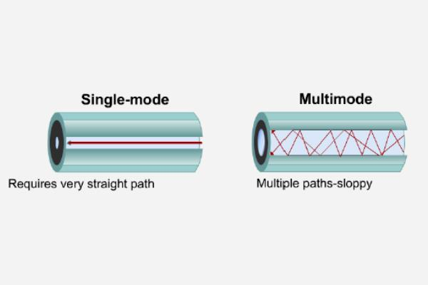
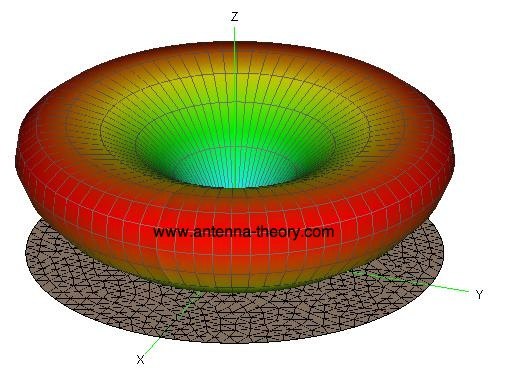
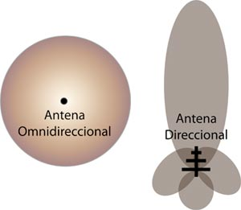
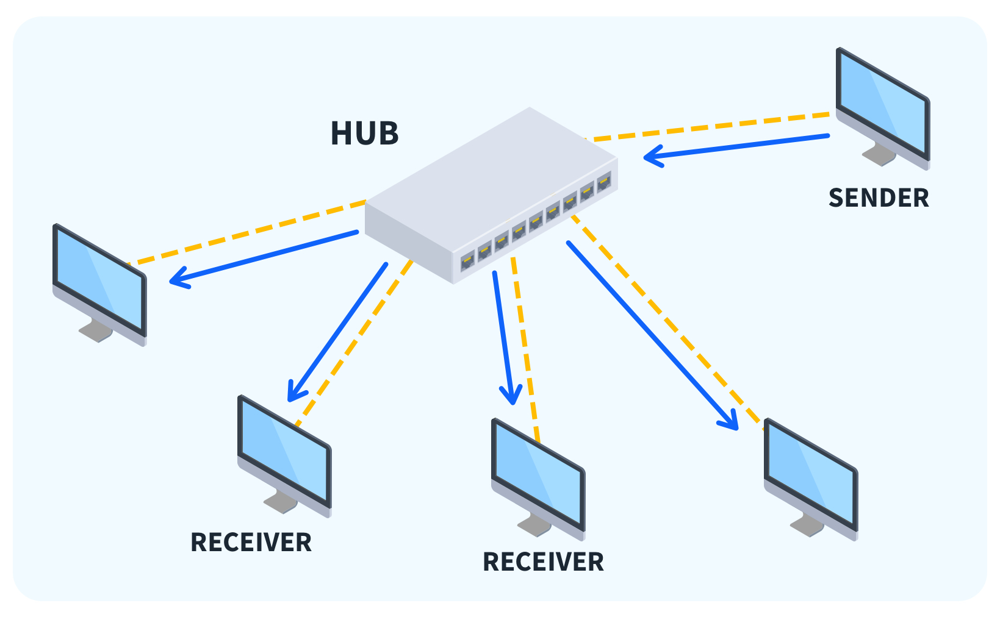
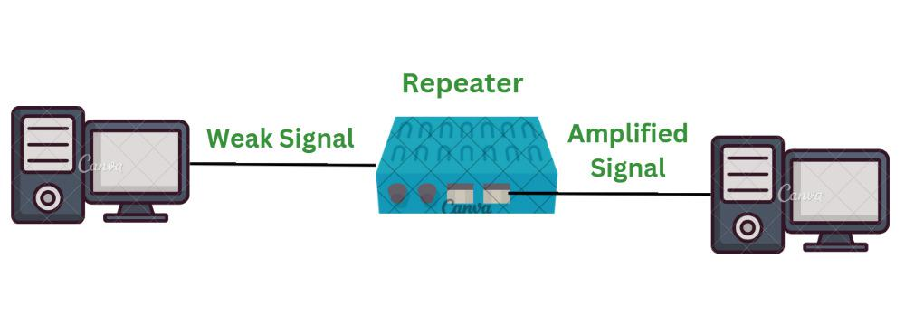
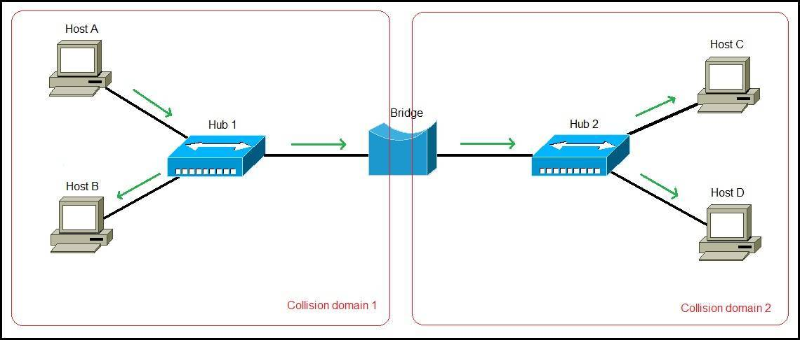
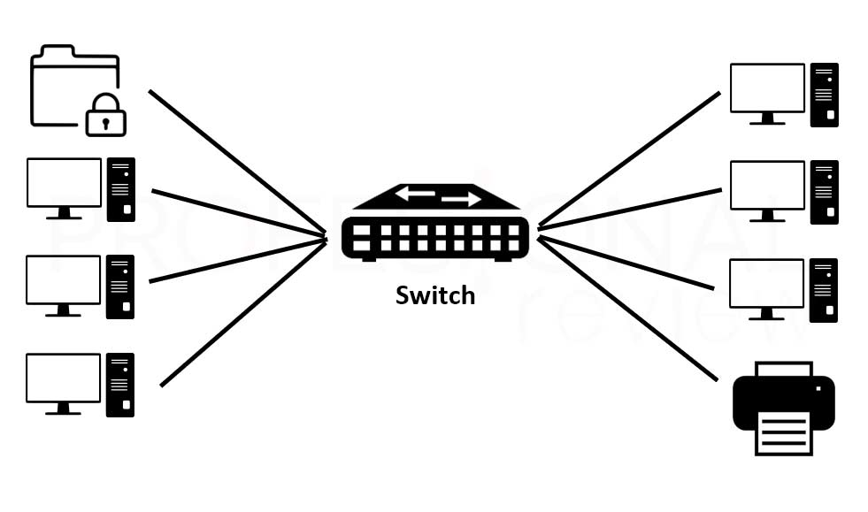
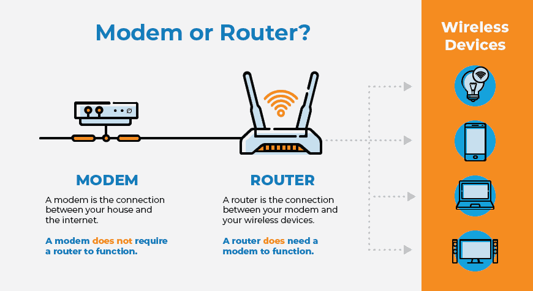
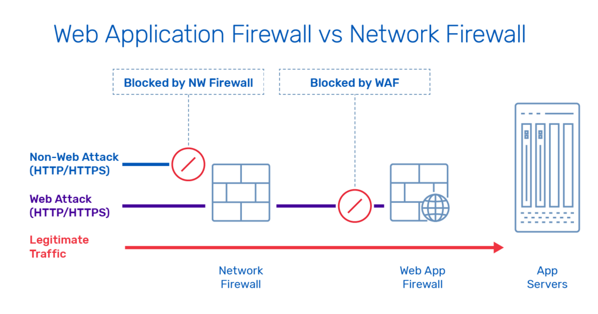

# Apuntes – Clase de Redes Martes 10 de Marzo

**Aviso:** La entrega del proyecto opcional se corrió para el **viernes 20 de marzo**.

---

# 1. Proyecto

Si se utiliza **AWS**, existen diferentes herramientas para automatizar la creación de infraestructura.

### AWS CLI

Permite ejecutar comandos desde la terminal para administrar recursos.

Ejemplo de comando:

```
aws ec2 create
```

Este comando permite crear una instancia EC2 proporcionando toda la información necesaria.

### Automatización con scripts

Se puede crear un **archivo `.sh`** donde se incluyan los comandos necesarios.

En la sección **`user_data`** de la instancia EC2 se puede enviar un script que:

- ejecute **Docker Compose**
- levante automáticamente toda la infraestructura del proyecto

### Otras herramientas para infraestructura en AWS

Existen varias alternativas dependiendo del lenguaje o herramienta preferida:

- **Bash scripts**
- **Boto3** (Python)
- **AWS CDK**
- **CloudFormation**
- **Pulumi**
- **Terraform**

📌 **La herramienta más fácil de utilizar es Terraform.**

### Infraestructura esperada del proyecto

Una instancia **EC2** que ejecute:

- Docker
- Apache 1
- Apache 2
- Nginx
- Router
- Asterisk

A estos servicios se les deben **exponer los puertos necesarios**.

---

# 2. Introducción a Redes

## Internetworking

Se refiere a la conexión de **múltiples sistemas autónomos o descentralizados** que se comunican entre sí.

La idea principal es permitir la **interconexión de diferentes redes**.

Los conceptos más utilizados en redes son:

- **LAN**
- **WAN**

---

## SneakerNet

Al inicio del Internet, muchas computadoras estaban **aisladas**.

Por ejemplo, en sistemas **IBM**, si una persona quería mover datos entre computadoras:

1. Copiaba los datos en un **floppy disk**
2. Caminaba hasta otra computadora
3. Insertaba el disco y transfería los datos

A esto se le llamaba **SneakerNet**, porque **la persona caminando era el medio de transmisión de datos**.

---

# 3. Tipos de redes

### LAN (Local Area Network)

Red de área local que conecta dispositivos dentro de:

- una casa
- una oficina
- una universidad

---

### WAN (Wide Area Network)

Red que conecta múltiples LAN a gran escala.

Ejemplo:

- Internet
- Redes backbone

---

### MAN (Metropolitan Area Network)

Red que cubre **una ciudad**.

Hoy en día el término **no se utiliza mucho a nivel profesional**.

---

### PAN (Personal Area Network)

Red personal entre dispositivos cercanos.

Ejemplo:

- Bluetooth
- conexión entre celular y audífonos

---

# 4. Medios de transmisión

Los medios de transmisión se dividen en:

- **Guiados (Wired)**
- **No guiados (Wireless)**

---

# 4.1 Medios guiados (Wired)

La información viaja **a través de un cable físico**.

Tipos:

- **Ethernet**
- **Cable coaxial**
- **Par trenzado**

### Par trenzado

Utiliza conectores **RJ45**.

Ejemplo:

**Cat6 → hasta 1 Gbps**

También permite **PoE (Power over Ethernet)**:

Permite transmitir:

- datos
- electricidad

por el mismo cable.

---

## Fibra óptica

Transmite información mediante **luz**.

### Monomodo

- El haz de luz viaja **en línea recta**
- Permite **mayores distancias**

### Multimodo

- La luz viaja **rebotando dentro de la fibra**
- Se utiliza en **distancias más cortas**

<p align="center">

</p>

---

# 4.2 Medios no guiados (Wireless)

La información se transmite por **ondas electromagnéticas**.

Tipos:

- Satélites
- Microondas
- Radiofrecuencia

---

## Satélites

Funcionan mediante antenas que:

1. reciben la señal
2. la procesan
3. la retransmiten hacia la tierra

### Órbita geostacionaria

Un satélite en órbita geostacionaria:

- rota a la **misma velocidad que la Tierra**
- siempre permanece **en la misma posición relativa**

Las transmisiones **no son direccionales**, por lo que muchos dispositivos pueden recibir la señal.

El filtrado ocurre mediante la **MAC address** del dispositivo.

---

# 5. Antenas

## Antena monopolo

La potencia de transmisión determina **el área geográfica cubierta**.

<p align="center">

</p>

---

## Antena direccional

La potencia de transmisión se concentra formando un **lóbulo de radiación**.

Esto permite enviar la señal hacia **una dirección específica**.

<p align="center">

</p>

---

# 6. Internet

Internet es un sistema:

- **descentralizado**
- basado en un modelo **best-effort**

Esto significa que:

- la red **intenta entregar los paquetes**
- pero **no garantiza al 100% la entrega**

---

## Cables submarinos

Para conectar continentes se utilizan **cables de fibra óptica submarinos**.

Aunque existen tecnologías inalámbricas, estas presentan problemas como:

- menor ancho de banda
- interferencias climáticas
- pérdida de información

Por eso los cables submarinos siguen siendo **la infraestructura principal de Internet**.

---

# 7. Hardware de red

## Network Interface

Tarjeta de red que permite que un dispositivo se conecte a una red.

---

## Hub

Dispositivo con múltiples puertos RJ45.

Características:

- no aprende qué dispositivo está conectado
- envía la información **a todos los puertos**

Problemas:

- colisiones
- baja seguridad
- bajo rendimiento

<p align="center">

</p>

---

## Repeater

Dispositivo que:

1. recibe una señal
2. la filtra
3. la vuelve a enviar amplificada

Sirve para **extender la distancia de transmisión**.

<p align="center">

</p>

---

## Bridge

Dispositivo que conecta **dos segmentos de red**.

Puede bloquear tráfico entre segmentos.

Cuando un paquete **no es para el dispositivo**, se realiza un **drop**.

<p align="center">

</p>

---

## Switch

Es una mejora del hub.

Características:

- aprende las direcciones MAC
- reduce colisiones
- permite comunicación **full-duplex**

<p align="center">

</p>

---

## Router

Dispositivo que:

- dirige paquetes entre redes
- toma decisiones de **enrutamiento**

Opera principalmente en:

- **Capa 3 (Network)**
- en algunos casos **Capa 4**

---

## Modem

**Modulador / Demodulador**

Convierte:

- señales digitales
- señales analógicas

para permitir comunicación con el proveedor de internet.

<p align="center">

</p>

---

# 8. Seguridad en redes

## Firewall

Firewall clásico:

- opera en **Capa 3**
- bloquea **direcciones IP**

En **Capa 4** puede bloquear:

- puertos
- protocolos

---

## WAF (Web Application Firewall)

Opera en **Capa de Aplicación**.

Protege aplicaciones web contra ataques como:

- DoS
- SQL Injection
- exploits web

Muchos **cloud providers** incluyen WAF.

<p align="center">

</p>

---

# 9. Cableado estructurado

Se refiere a la **organización y distribución del cableado de red**.

Normalmente se utilizan:

- cables **RJ45**
- paneles de parcheo
- racks de red

---

# 10. Beneficios de las redes

- Conectividad efectiva
- Confiabilidad
- Administración centralizada
- Escalabilidad
- Compartición de recursos

---

# 11. Usos de las redes

- Compartir recursos
- Almacenamiento
- Redundancia
- Comunicación
- Negocios digitales
- Arquitecturas cliente-servidor

Ejemplo histórico:

**Napster**, uno de los primeros sistemas **peer-to-peer**, donde los usuarios compartían archivos.

---

# 12. Modelo OSI

**Open Systems Interconnection**

Es un **modelo de referencia** para diseñar redes.

Se divide en **7 capas**.

La comunicación se divide en capas para:

- facilitar el diseño
- mejorar la interoperabilidad
- simplificar la comprensión

---

## Funciones del modelo

- estandarización
- interoperabilidad
- control de flujo
- control de congestión
- seguridad

---

# 13. Capas del modelo OSI

1. **Physical**
2. **Data Link**
3. **Network**
4. **Transport**
5. **Session**
6. **Presentation**
7. **Application**

En la práctica del curso se enfocan principalmente en:

- Física
- Data Link
- Network
- Transport
- Application

---

# 14. Protocolo de red

Un **protocolo** es un conjunto de reglas que define cómo se transmiten los datos entre dispositivos.

Permite que dispositivos diferentes puedan comunicarse **independientemente de su hardware o software**.

Hoy en día la pila más utilizada es:

- **Ethernet** → Capa 1 y 2
- **IP** → Capa 3
- **TCP** → Capa 4
- **HTTP** → Capa 7