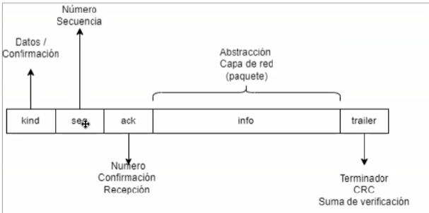
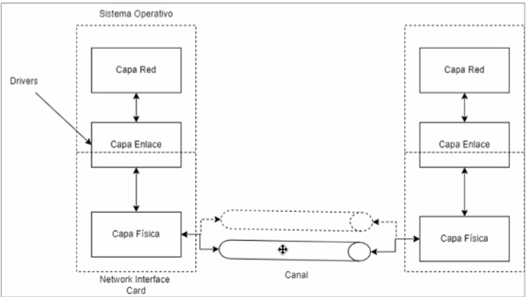
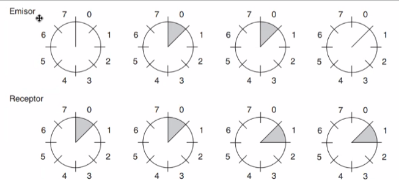

# Apuntes – Clase de Redes Viernes 10 de Abril

## Estudiante: Mariela Solano Gómez - 2022437963

**Abstract**

En este documento se abordan los principales conceptos relacionados con la capa de enlace de datos y la subcapa de control de acceso al medio (MAC) dentro de las redes de computadoras. Se analiza el problema del uso de un medio compartido y las implicaciones que esto tiene en términos de control de flujo, eficiencia y confiabilidad en la transmisión de datos.

Se estudian los protocolos de enlace elementales, incluyendo variantes de comunicación simplex y mecanismos como parada y espera, así como el manejo de canales ruidosos mediante números de secuencia y temporizadores (timeouts). Además, se introduce el concepto de ventana deslizante y técnicas de canalización como Go-Back-N y Repetición Selectiva, orientadas a mejorar el rendimiento del canal.

Asimismo, se examina la importancia del MTU y el uso de Jumbo Frames en la optimización de la transmisión de datos, destacando su impacto en la reducción del overhead y el aprovechamiento del ancho de banda, especialmente en aplicaciones como bases de datos.

Finalmente, se aborda el problema de asignación del canal en medios compartidos, junto con técnicas de asignación estática como FDM y TDM, sus limitaciones y los aspectos fundamentales que influyen en el diseño de protocolos de acceso múltiple.

## Continuación - 3. La capa de enlace de datos

En toda red nosotros vamos a tener un recurso compartido, que es el medio por el cual vamos a hacer envío de datos. Este medio va a tener un ancho de banda que va a estar determinado por el material del medio, por la cobertura y por el rango de frecuencias que pueden operar a través del medio.

En un mundo ideal tendríamos una conexión entre diferentes estaciones llamadas **(Fully Connected)** → va a existir una conexión dedicada entre cada uno de los dispositivos que hay en la red. Esto implica que vamos a tener una tarjeta de red y un canal dedicado para cada dispositivo. Esto no se puede implementar en la vida real por cuestiones de costo, por lo tanto nos toca compartir un medio.

En este medio pueden haber muchas computadoras **(estaciones)** con distintas características de hardware y software. Algo muy importante son las tarjetas de red, que afectan la velocidad a la que se puede trabajar. Estas diferencias implican **problemas de control de flujo**, ya que una computadora muy grande que está enviando muchas tramas a otra computadora más pequeña, lo que satura a la computadora más pequeña. Pero la computadora grande no se da cuenta de qué pasa en la red, y la otra computadora empieza a degradar su rendimiento, ya que no se puede mantener al día en la recepción y envío de tramas. Este problema lo maneja de manera explícita: la máquina afectada envía una trama de confirmación y en ella viene una bandera encendida “*control de flujo*”. Y lo que hace la máquina más grande es reducir la velocidad a la cual está transmitiendo. La otra manera es de forma implícita, en la que la máquina pequeña está tan degradada en rendimiento que ni siquiera puede enviar la trama de que le llegaron las cosas bien; esto causa que la computadora grande tenga timeouts. Por diseño de capas de transporte, la máquina asume que en medio del trayecto por el cual están pasando sus paquetes hay un router que no puede hacer envío de información porque está en congestión.

Ninguna máquina en una red tiene conocimiento de cómo es la red. La computadora sabe que hay camino (Ethernet), sabe que está en un medio seguro, que está en cobre, que la probabilidad de que se dañen paquetes es baja y se pregunta si hay algún problema en la red. Por lo que baja la velocidad de transmisión, para intentar que la información llegue a la máquina objetivo. Ayuda a reducir el problema de control de flujo, problema que se tiene en las redes en la capa de Enlace de datos.

### Protocolos de enlace elementales

No se utilizan en la vida real, se estudian para hacer una comparación con las redes que tenemos. Protocolos utópicos, desde el punto de vista económico no hay ventaja en implementarlos.

#### Diseño de Frame

#### Esquema

Donde se va a dar la ejecución de estos algoritmos de transmisión.

Dos computadoras, en estas computadoras tengo un canal (envío/transmisión).  

- **Half Duplex:** comparten el mismo medio.
- **Ventanas:** enviar tramas por turnos.
- **Device Drivers:** servicios primitivos que permiten que el Sistema Operativo hable de manera general con el hardware.

#### Protocolo Simplex Utópico

Hacer envío de tramas y no requiere ningún tipo de confirmación. Porque el medio no tiene ningún tipo de error.

- **Simplex:** comunicaciones unidireccionales.
- **Sender:** definición de una trama y un buffer de paquete (pedacito de información). Envía la trama a través del medio.
- **Receiver:** va a estar esperando un evento (recepción de una trama). Se desbloquea cuando la trama llega.

#### Protocolo Simplex de parada y espera para un canal libre de errores

Hacer el envío de una trama y queda esperando que la trama me confirme.

- **Round trip:** el tiempo total que tarda la solicitud en viajar por la red más el tiempo de la respuesta que hace el viaje inverso.
- **Canalización:** sacar el máximo provecho al canal, enviando la mayor cantidad de paquetes que quepan en un round trip.
- **Sender:** definición de una trama, un buffer de paquete y un evento que se bloquea hasta que no se reciba una confirmación de recepción del paquete.
- **Receiver:** espera el evento de recibir una trama, desbloquea el receptor, lee la capa de red, entrega el paquete y envía una confirmación de recepción que desbloquea el evento en el sender.

#### Protocolo Simplex de parada y espera para un canal ruidoso

- **Sender:** vamos a tener un **número de secuencia (siguiente trama a enviar)**, definición de una trama, un buffer de paquete y un evento. Se necesita número de secuencia porque el canal es ruidoso (Ej: microondas encendido, interferencia térmica, señal electromagnética, motores de cocheras mal calibrados, etc). Se puede dañar la información en el envío y se necesita reenviar una copia de la trama. También al arrancar el proceso de envío de trama se empieza un timer asíncrono; cuando expira genera una interrupción que desbloquea el proceso.
- **Receiver:** tiene un **número de secuencia esperado (siguiente trama a recibir)**, una trama, un buffer de paquete y un evento. Verifica que el evento que llegó sea una trama; si el número de secuencia es igual al número de frame que estoy esperando, le pasa la trama a la capa de red e incrementa el número de secuencia esperado. En caso contrario, que el número de secuencia sea distinto al esperado, esto significa que por alguna razón recibió una copia de una trama que acaba de recibir.

 

### Ventana Deslizante (half duplex → full duplex)

Mecanismo usado en redes para **controlar el flujo de datos** entre emisor y receptor.

Permite enviar **varios paquetes sin esperar confirmación inmediata de cada uno**, mejorando la eficiencia.

- El emisor tiene una “ventana” de paquetes que puede enviar.
- A medida que el receptor confirma (ACKs), la ventana **se mueve (desliza)** y permite enviar más datos.
- Permite un **flujo continuo de datos y confirmaciones en ambos sentidos**, aprovechando mejor el canal (similar a un comportamiento full duplex).

### Timeouts

Mecanismo utilizado en redes para establecer un **límite de tiempo de espera** ante la recepción de una respuesta. Si dicho tiempo expira sin recibir confirmación (por ejemplo, un ACK), el sistema **asume la pérdida o falla** en la transmisión.

Su función principal es **garantizar la confiabilidad de la comunicación**, permitiendo detectar errores y activar acciones como la **retransmisión de datos** o el manejo de fallos.

### Canalización

- **Retroceso N (Go-Back-N):**

En presencia de un error, el receptor **descarta la trama errónea y todas las subsecuentes**, y el emisor retransmite desde la trama donde ocurrió el fallo. Generalmente se apoya en **ACKs acumulativos** (no siempre usa NACK).

- **Repetición selectiva (Selective Repeat):**

Solo se descarta la **trama dañada**, mientras que las tramas correctas se almacenan en un buffer de la capa de enlace. El emisor retransmite **únicamente las tramas con error**, normalmente apoyándose en **NACKs o ACKs individuales**.

- **NACK (Negative Acknowledgment):**

Es un mensaje enviado por el receptor para indicar que una trama fue recibida con errores, solicitando su **retransmisión**. Se utiliza principalmente en protocolos como la repetición selectiva para mejorar la eficiencia.

## 4. Subcapa de control de acceso al medio

En las capas inferiores del modelo de red, muchos parámetros ya vienen **predefinidos o configurados automáticamente** por la red o los dispositivos. Sin embargo, uno de los parámetros que puede ajustarse es el **MTU (Maximum Transmission Unit)**, que define el **tamaño máximo de las tramas o paquetes** que pueden transmitirse.

- **Jumbo Frames:**

Son tramas de mayor tamaño que el MTU estándar (generalmente mayores a 1500 bytes). Su uso permite **mejorar la eficiencia de la red**, ya que se envían más datos por trama y se reduce la sobrecarga.

Para que funcionen correctamente, es necesario que **todos los dispositivos en el enlace (como routers, switches y hosts)** soporten Jumbo Frames. De lo contrario, pueden ocurrir problemas como **fragmentación o pérdida de paquetes**.

### Optimización de paginación en redes (con uso de MTU y Jumbo Frames)

La optimización de la paginación en redes consiste en adecuar el tamaño de los bloques de datos transmitidos para que se ajusten eficientemente a la **Unidad Máxima de Transmisión (MTU)**, con el fin de reducir la sobrecarga (overhead) y mejorar el rendimiento general de la comunicación.

En sistemas de bases de datos como MySQL, la información se organiza en **páginas de tamaño fijo** (comúnmente 16 KB). Cuando estas páginas deben transmitirse a través de la red, su tamaño suele exceder el MTU estándar (aproximadamente 1500 bytes), lo que provoca su fragmentación en múltiples paquetes. Cada uno de estos paquetes incorpora encabezados adicionales de protocolos (como TCP/IP y Ethernet), generando un incremento en el consumo de ancho de banda y en el uso de recursos de procesamiento.

El uso de **Jumbo Frames**, que permiten aumentar el MTU (por ejemplo, hasta 9000 bytes), reduce significativamente la cantidad de paquetes necesarios para transmitir una misma página de datos. Esta reducción implica una menor cantidad de encabezados, disminuyendo el overhead y optimizando el uso del ancho de banda. Además, al reducir el número de paquetes, se disminuye la carga sobre la CPU y se mejora la eficiencia en la transmisión de datos.

En este contexto, al lograr una mayor correspondencia entre el tamaño de las páginas de datos y el tamaño de las tramas de red, se minimiza la fragmentación, lo que se traduce en una comunicación más eficiente. Esto resulta especialmente relevante en entornos de alto rendimiento, donde el uso adecuado de los recursos de red y procesamiento es crítico.

### Problema de asignación del canal

El problema de asignación del canal surge en redes de comunicación cuando **múltiples emisores comparten un mismo medio de transmisión**. En este contexto, se busca definir mecanismos eficientes para **asignar el uso del canal de difusión** entre usuarios que compiten por acceder a él.

Si todos los dispositivos pudieran transmitir simultáneamente sin control, se producirían **interferencias y colisiones**, afectando la integridad y eficiencia de la comunicación.

Este tipo de medio compartido se conoce como **canal de difusión**, también denominado **canal de acceso múltiple o acceso aleatorio**, ya que permite que varios dispositivos intenten acceder al mismo canal de forma no coordinada.

Para gestionar este problema, se utiliza la subcapa **MAC (Medium Access Control)**, encargada de regular el acceso al medio, evitando colisiones o minimizando su impacto mediante distintos protocolos.

La correcta asignación del canal es de **vital importancia en redes de área local (LAN)**, especialmente en entornos inalámbricos, donde el medio es inherentemente compartido y más propenso a interferencias.

### Asignación Estática

Una de las estrategias para resolver el problema de asignación del canal consiste en **dividir el medio de transmisión** entre múltiples usuarios, de forma que cada uno utilice una porción específica del recurso.

Entre las principales técnicas se encuentran:

- **FDM (Frequency Division Multiplexing):** el canal se divide en diferentes **bandas de frecuencia**, asignando cada una a un usuario distinto.
- **TDM (Time Division Multiplexing):** el canal se divide en **intervalos de tiempo**, permitiendo que cada usuario transmita en turnos asignados.

Un ejemplo clásico de FDM es la **radio FM**, donde cada emisora transmite en una frecuencia distinta dentro del espectro disponible.

#### Limitaciones

Estas técnicas presentan desventajas en ciertos escenarios:

- No son eficientes cuando existe un **gran número de usuarios** o cuando este número es **variable**.
- Resultan inadecuadas para **tráfico en ráfagas**, donde los dispositivos no transmiten de manera continua.
- Pueden provocar **desperdicio de recursos**, ya que el canal asignado permanece ocioso si el usuario no transmite.

A pesar de sus limitaciones, estas técnicas permiten un uso **ordenado y libre de colisiones** del medio. Sin embargo, su eficiencia depende de que el canal asignado sea utilizado de forma constante, de lo contrario se reduce el **aprovechamiento efectivo del espectro**.

#### Aspectos importantes

En el estudio de protocolos de acceso múltiple, se consideran los siguientes aspectos fundamentales:

- **Tráfico independiente:**
Las tramas se generan de forma **independiente y en ráfagas**. Una vez que el emisor transmite una trama, debe **esperar su confirmación (éxito o retransmisión)** antes de continuar.
- **Canal único:**
Todos los dispositivos comparten un **mismo medio de transmisión**, lo que implica competencia por el acceso al canal.
- **Colisiones observables:**
Si dos dispositivos transmiten simultáneamente, las señales se **traslapan**, produciendo una colisión que corrompe las tramas. Esto obliga a realizar una **retransmisión**.
- **Tiempo continuo o ranurado:**
    - **Continuo:** las transmisiones pueden iniciarse en **cualquier instante**.
    - **Ranurado:** las transmisiones solo pueden comenzar en **instantes discretos** definidos por un reloj (ranuras de tiempo), lo que reduce la probabilidad de colisiones.
- **Detección de portadora (Carrier Sense):**
    - **Con detección:** el dispositivo verifica si el canal está ocupado antes de transmitir.
    - **Sin detección:** el dispositivo transmite sin verificar el estado del canal, aumentando el riesgo de colisiones.
- **Confiabilidad:**
Ningún protocolo de acceso múltiple garantiza por sí mismo la **entrega confiable de los datos**; esta responsabilidad recae en **capas superiores** (por ejemplo, la capa de transporte).