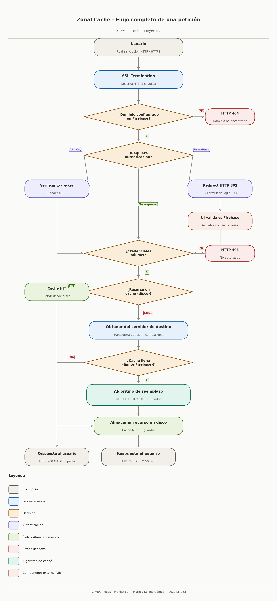

# Apuntes – Clase de Redes · Martes 28 de Abril

**Estudiante:** Mariela Solano Gómez · 2022437963  
**Curso:** IC 7602 – Redes · Primer Semestre 2026

---

## Información administrativa

- El Proyecto 1 se extiende una semana más; la revisión es el domingo.
- El profesor explicó el Proyecto 2 en esta clase.
- **Valor:** 20% de la nota final.
- **Entrega:** viernes 29 de mayo 2026 antes de las 11:59 pm.
- **Revisión virtual:** domingo 31 de mayo 2026 — todos los integrantes deben estar presentes.
- Grupos de hasta 5 personas.
- El proyecto debe estar **completamente automatizado con Helm**; sin automatización la nota es 0.
- Se requieren **pruebas unitarias** obligatoriamente; su ausencia equivale a nota 0.
- La documentación debe estar en **Markdown**.
- Entregable: archivo `.tar.gz` + link al repositorio, siguiendo los lineamientos del programa.

---

## Objetivo

Implementar un **proxy/caché de aplicación con geolocalización**. El sistema intercepta peticiones DNS, las redirige a cachés zonales seleccionadas según la ubicación geográfica del usuario (base de datos *IP to Country*, ya usada en el Proyecto 1), y actúa como intermediario entre el cliente y el servidor de destino.

---

## Componentes del sistema

### 1. DNS Interceptor

Tomado y adaptado del Proyecto 1. Actúa como intermediario entre el cliente y el servidor DNS.

- Intercepta peticiones a dominios configurados y las redirige hacia la **caché zonal** correspondiente según la IP de origen del usuario.
- Implementado en **Rust**, ejecutado en **Kubernetes**, automatizado con **Helm Charts**.
- Para probar: usar `nslookup`.

---

### 2. Zonal Cache *(componente principal – vale 50%)*

Servicio de **caché HTTP en disco**. Obtiene su configuración desde **Firebase**. Es el corazón del sistema y actúa como proxy entre el usuario y el servidor de destino.

**Flujo de una petición:**

1. El usuario hace una petición (ej. `www.google.com` → puerto 80/TCP).
2. La caché consulta Firebase para saber si el dominio está configurado y cómo tratarlo (tamaño de caché, algoritmo, autenticación requerida).
3. Si se requiere autenticación, la caché verifica las credenciales:
   - **API Key:** revisa el header `x-api-key`.
   - **Usuario/contraseña:** devuelve un `HTTP 302` que redirige al formulario de login en la UI. El usuario ingresa sus datos, la UI los valida contra Firebase y devuelve una cookie de sesión. En peticiones posteriores, la caché extrae la cookie del request y la valida contra Firebase.
4. Si el recurso está en caché → se sirve desde disco.
5. Si no está en caché → se obtiene del servidor de destino (hay que transformar la petición y cambiar el host), se almacena en disco, y se sirve al cliente.
6. Si se excede el tamaño máximo de caché → se aplica el algoritmo de reemplazo configurado.

**Algoritmos de reemplazo implementados:**

- LRU (Least Recently Used)
- LFU (Least Frequently Used)
- FIFO (First-In, First-Out)
- MRU (Most Recently Used)
- Random

**Autenticación soportada:**

- `x-api-key` en el header HTTP.
- Usuario y contraseña con sesión por cookie (callback hacia la UI → `HTTP 302`).

**Otras características:**

- SSL Termination: la caché recibe HTTPS, le quita la encriptación y hace la petición al destino en HTTP cuando aplica.
- El tamaño máximo de caché **por dominio** está definido en Firebase.
- Implementado en **Rust**, ejecutado en **Kubernetes**, automatizado con **Helm Charts**.
- Para probar: usar `postman` o `curl`.

---

### 3. REST API

- Implementa los verbos HTTP: `GET`, `POST`, `PUT`, `DELETE`.
- Implementada en **Java**.
- Ejecutada en **Kubernetes**, automatizada con **Helm Charts**.

---

### 4. Apache Server

- Sirve una página **HTML básica**.
- Ejecutado en **Kubernetes**, automatizado con **Helm Charts**.

---

### 5. REST API en Node.js

- Expone los endpoints que necesitan la **UI** y las **cachés zonales** para interactuar con Firebase/Firestore.
- Debe implementar algún mecanismo de **autenticación y autorización** (se puede usar Firebase Auth).
- Ejecutado en **Vercel** con **deployments automáticos desde GitHub**.

---

### 6. UI (Interfaz Web)

- Desarrollada en **React + Vite + TailwindCSS**, con apoyo de IA generativa.
- Ejecutada en **Vercel** con deployments automáticos desde GitHub.

**Funcionalidades:**

| Función | Descripción |
|---|---|
| Registro | Crear cuenta y registrar un dominio (validado con registro TXT). Buscar un host gratuito. |
| Administración de dominios | Agregar y eliminar dominios (verificar propiedad con registro TXT). |
| Administración de URLs | Crear, eliminar y modificar URLs dentro de un dominio (soporta wildcards). |
| Configuración por URL | Tamaño de caché, tipos de archivo (png, html, css, js…), TTL, política de reemplazo. |
| Mecanismo de autenticación | API Key (`x-api-key`) o usuario/contraseña. |
| Gestión de usuarios/API Keys | Crear, eliminar y modificar usuarios o API Keys según el mecanismo elegido. |
| Formulario de login | Usado por las cachés zonales cuando se requiere autenticación por sesión. |
| Cerrar sesión | — |

---

## Pruebas requeridas por la especificación

El sistema debe probarse con:

1. El REST API (Java).
2. El Apache Server con HTML simple.
3. Un sitio web externo con HTTP.
4. Un sitio web externo con HTTPS.

---

## Automatización

- Todo debe estar en **Kubernetes/Docker** + **Helm Charts / Docker Compose**.
- **Cero valores quemados en el código** — toda configuración se inyecta via variables de entorno.
- Si cualquier parte no está automatizada → nota 0 en esa sección.

---

## Evaluación

| Rubro | Valor |
|---|---|
| Documentación | 15% |
| DNS Interceptor | 10% |
| Zonal Cache | 50% |
| REST API Node.js / UI | 20% |
| REST API Java / Apache Server | 5% |

---

## Documentación requerida

- Instrucciones claras para correr el proyecto.
- Pasos para reproducir las pruebas.
- Mínimo **10 recomendaciones** y **10 conclusiones**.
- Diagramas de arquitectura, diagramas de flujo y pruebas unitarias son parte de las buenas prácticas esperadas.

---

> **Recomendación del profesor:** hacer *peer-review* y checkpoints semanales. No esperar al último momento para integrar los componentes.