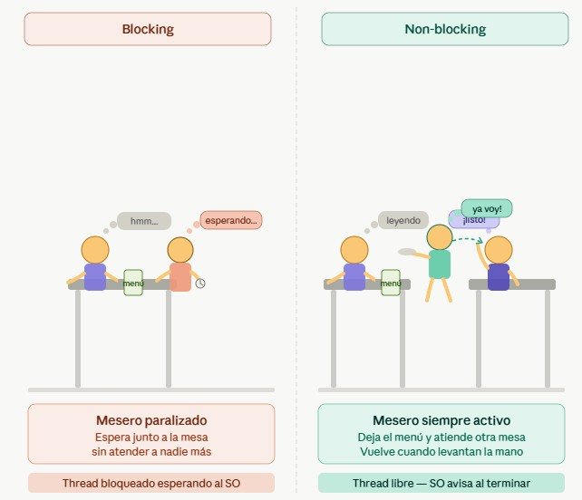
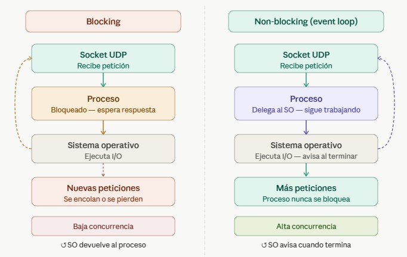
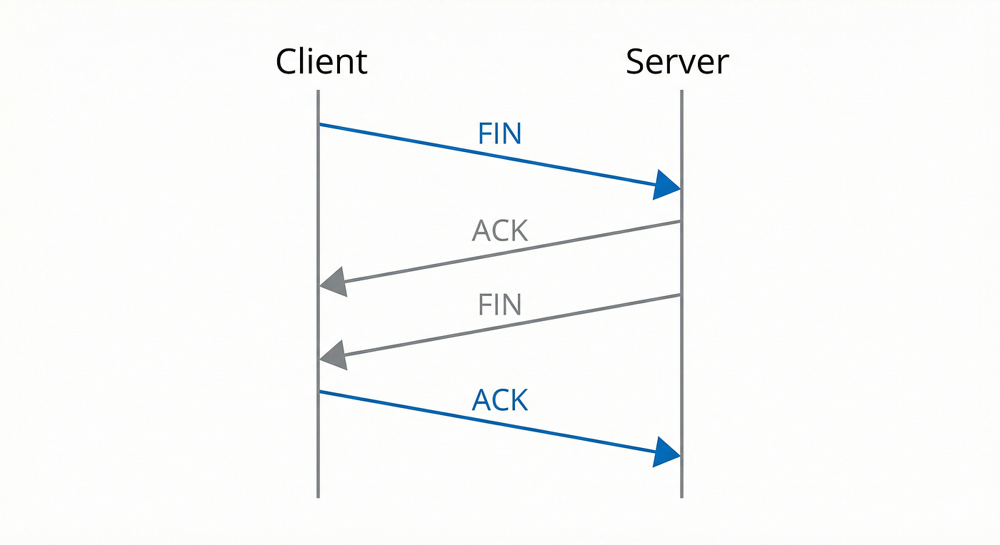

# Apuntes – Clase de Redes · Viernes 22 de Mayo

**Estudiante:** Mariela Solano Gómez · 2022437963  
**Curso:** IC 7602 – Redes · Primer Semestre 2026

---

## 1. Establecimiento de conexión TCP (Three-Way Handshake)

El proceso de conexión TCP sigue estos pasos:

1. **SYN** — El cliente envía un paquete con la bandera `SYN` (connection request) junto con su número de secuencia inicial.
2. **SYN-ACK** — El servidor responde con su propio `SYN` más un `ACK` de confirmación.
3. **ACK** — El cliente confirma con un `ACK` final. La conexión queda establecida.

> El paquete SYN inicial se dirige al puerto del servidor (ej. puerto 443 para HTTPS).

---

## 2. Creación de Thread y Socket al establecer conexión TCP

Cuando llega el primer `SYN`, el servidor realiza las siguientes operaciones:

- **Crea un thread o toma uno del thread pool** para manejar la conexión.
- **Crea un nuevo socket** (`create socket`) → esto abre un canal de comunicación nuevo para no bloquear el puerto principal.
- El nuevo canal usa un **puerto TCP alto** (normalmente > 30,000), por ejemplo el puerto `30125`.

### ¿Por qué es necesario thread + socket?

Para poder manejar:

- Retries y timeouts
- Buffers para ordenar paquetes
- Administración de confirmaciones (ACKs)
- Ventanas de envío

Tanto el cliente como el servidor mantienen este esquema de socket + thread.

---

## 3. Thread Pool

El **thread pool** es un conjunto de threads creados anticipadamente que permanecen dormidos esperando trabajo.

**¿Por qué usarlo?**
Crear un thread/proceso en el momento que llega una conexión es costoso porque implica:

- Context switches
- Interrupciones al sistema operativo
- Reservar memoria
- Crear identificadores de proceso (PID)

Con un thread pool (ej. 25 threads), ese costo se paga una sola vez al arrancar el servidor. Al llegar conexiones, simplemente se toma un thread disponible.

---

## 4. Multiplexión por Almacenamiento

Cada datagrama entrante se guarda en un buffer esperando a que lleguen todos los fragmentos para ensamblar el paquete completo antes de pasarlo a la capa superior.

---

## 5. UDP — Modelo General

UDP es un protocolo sin conexión, sin confirmaciones y sin reordenamiento de paquetes.

**Características:**

- Paquetes pequeños
- No requiere handshake
- No confirma entrega
- No maneja retries, timeouts ni ventanas
- Trabajo rápido por parte del servidor

**Casos de uso ideales:**

- Geolocalización en tiempo real
- DNS
- Streaming de video/audio (IPTV, VoIP)
- Juegos multijugador en línea
- Métricas de sistema / IoT / time series
- Eventos de tiempo real

---

## 6. Socket UDP: Modo Blocking vs Non-Blocking

### Blocking

- El proceso le dice al SO: *"Espérame en el puerto X hasta que llegue algo."*
- Cuando llega un paquete, el socket se despierta, procesa el trabajo y vuelve a esperar.
- Si el trabajo tarda mucho, las nuevas peticiones se encolan en la tarjeta de red.
- Se puede combinar con un **thread pool** para desacoplar el procesamiento del socket y reducir el tiempo de bloqueo.

### Non-Blocking (Event Loop)

- El proceso le dice al SO: *"Hace esto por mí y avísame cuando termines."*
- El proceso nunca se bloquea; sigue atendiendo peticiones mientras el SO trabaja.
- **Analogía del mesero:** en modo blocking el mesero espera al lado de la mesa; en modo non-blocking deja el menú, atiende otras mesas y vuelve cuando el cliente levanta la mano.
- Utilizado por sistemas de alto rendimiento: **Nginx**, balanceadores de Amazon, etc.
- Este modelo se llama también **asíncrono**.

**Ventaja clave:** al nunca bloquearse, aumenta enormemente la concurrencia y el número de peticiones atendidas por unidad de tiempo.

---

## 7. DNS: Caso de Uso TCP vs UDP

El servidor DNS (ej. `8.8.8.8` de Google) recibe **millones de peticiones simultáneas**.

### ¿Por qué no TCP para DNS?

- Cada conexión TCP requiere: 3 mensajes de apertura + mensajes de datos + 3 mensajes de cierre + thread + socket + file descriptors.
- Con TCP, el límite de conexiones simultáneas está dado por los puertos disponibles (~35,536 clientes simultáneos máximo).
- Demasiado overhead para una consulta que dura milisegundos.

### Solución: UDP + Non-Blocking + Thread Pool + Cola de Mensajes

1. El socket UDP recibe la petición y la encola inmediatamente.
2. El thread pool consume mensajes de la cola y procesa (busca el IP en la base de datos).
3. El resultado se le pasa al socket principal para que lo envíe al cliente.
4. El socket nunca se bloquea (event loop).

**La confiabilidad en DNS** recae en el **cliente** a nivel de capa de aplicación, que implementa sus propios retries y timeouts.

---

## 8. Liberación de Conexión TCP (Four-Way Handshake)

Para cerrar una conexión TCP:

1. **FIN** — El host que quiere terminar envía un `FIN` (disconnection request).
2. **ACK + FIN** — El receptor confirma y envía su propio `FIN`.
3. **ACK** — El host inicial confirma el cierre.

Siempre que se envía un `FIN`, se activa un **temporizador**. Si el ACK se pierde:

- El extremo que espera el ACK se queda en espera hasta que expira el timer y cierra la conexión.
- Si el FIN se pierde repetidamente, ambos extremos agotan los retries y dan la conexión por terminada.

---

## 9. Elementos del Protocolo de Transporte (TCP)

| Elemento | Descripción |
|---|---|
| **Control de errores** | CRC / Suma de verificación (checksum) en el trailer |
| **Número de secuencia** | Permite ordenar los datagramas que llegan desordenados |
| **Buffer** | Almacena datagramas hasta poder ensamblar el paquete original |
| **Parada y espera** | Envía y espera confirmación antes de continuar |
| **Ventana deslizante** | Solo un extremo envía datos a la vez |
| **Multiplexión por almacenamiento** | Un buffer compartido para múltiples conexiones simultáneas |
| **ARQ (Automatic Repeat Request)** | Si llega un datagrama dañado, se envía un NACK con el número de secuencia para pedir reenvío |
| **Multiplexión inversa (SCTP)** | Permite enviar paquetes de una misma conexión por múltiples enlaces físicos |

---

## 10. Multiplexión Inversa (SCTP — Stream Control Transmission Protocol)

Permite **dividir el tráfico de una conexión entre múltiples enlaces de red** simultáneamente.

- Ejemplo: tener Kolbi + Telecable activos al mismo tiempo → rendimiento combinado de 800 Mbps en lugar de 400 Mbps.
- Diferente al **load balancing** (que reparte conexiones distintas por cada enlace).
- Dispositivos como **MikroTik** permiten configurar esto en casa (multiplexión inversa, load balancing y failover).

---

## 11. Control de Congestión

**Congestión:** muchos paquetes moviéndose sobre un segmento de red → buffers de router se llenan → aumenta uso de CPU y memoria → timeouts y retries en los clientes.

### Responsabilidad

El problema se origina en la **capa de red** (routers), pero se trata desde la **capa de transporte** (regulando la tasa de envío).

### Objetivos del control de congestión:

1. **Buena asignación de ancho de banda** — usar la mayor parte del enlace disponible para datos, no overhead.
2. **Aumentar envío hasta que el retardo (RTT) suba rápidamente** — señal de que el router está llegando a su límite.
3. **Equidad** — evitar que un cliente monopolice el ancho de banda.
4. **Convergencia al punto ideal** — QoS: no aceptar más conexiones de las que se pueden manejar.
5. **Regulación de tasa de envío** — reducir el flujo cuando se detecta congestión (como cerrar parcialmente una llave de agua).

**Detección de congestión:** la tasa de envío se reduce cuando aumenta el retardo o cuando se pierden paquetes (asumiendo que en cobre/Ethernet la única causa de pérdida es congestión).

---

## 12. Redes Inalámbricas y el Problema de Congestión Falsa

### El supuesto de cobre/Ethernet

Los protocolos TCP/IP fueron diseñados asumiendo que el medio físico es cobre con Ethernet — un medio muy confiable donde la pérdida de un paquete solo puede ocurrir por congestión.

### Problema con Wireless

Una conexión WiFi tiene una **tasa de pérdida de paquetes de ~50% por naturaleza del medio**.

Consecuencia:

- La capa de transporte interpreta cada paquete perdido como **congestión**.
- Reduce continuamente la tasa de envío.
- Se **desperdicia el ancho de banda contratado**.
- A escala de internet, todos los clientes wireless hacen lo mismo, degradando el rendimiento global.

### Solución: Segmentación a nivel de tarjeta de red

La tarjeta de red inalámbrica opera en las capas **Física, Data Link y Red** del modelo OSI.

Lo que hace:

1. Intercepta el datagrama de la capa de transporte (ej. 10 MB).
2. Lo **fragmenta en segmentos más pequeños** (ej. 10 segmentos de 1 MB), cada uno con número de secuencia.
3. Gestiona la **retransmisión de los segmentos perdidos** directamente con el access point.
4. La **capa de transporte solo ve un datagrama enviado** → nunca detecta la pérdida, nunca reduce la velocidad.

Este mecanismo **engaña al sistema operativo** haciéndole creer que sigue viajando sobre cobre/Ethernet.

---

## 13. Administración Remota de Servidores vía UDP

Algunas tarjetas de red de servidores (ej. iDRAC, IPMI) reservan un **puerto UDP alto** (ej. `31225`) para funciones de administración remota.

Funcionamiento en el modelo OSI:

- La tarjeta intercepta el tráfico en ese puerto a nivel de **capa física/data link/red**, antes de que llegue a la capa de transporte/aplicación del SO.
- Permite ejecutar operaciones como **hardware reset** (reinicio físico del servidor) de forma remota.
- El servidor puede estar apagado o con el SO no funcional y aún así responde.

Esto reemplaza el antiguo modelo de *remote hands* (pagar a alguien en el datacenter para reiniciar físicamente un servidor).

---

## Resumen: TCP vs UDP

| Característica | TCP | UDP |
|---|---|---|
| Conexión | Sí (3-way handshake) | No |
| Confirmación de entrega | Sí (ACKs) | No |
| Orden de paquetes | Sí (números de secuencia) | No |
| Retransmisión | Sí (ARQ) | No (responsabilidad del cliente) |
| Ventana deslizante | Sí | No |
| Overhead de SO | Alto (threads, sockets, file descriptors) | Mínimo |
| Velocidad | Menor | Mayor |
| Casos de uso | HTTP/S, transferencia de archivos, email | DNS, streaming, IoT, juegos, VoIP |
