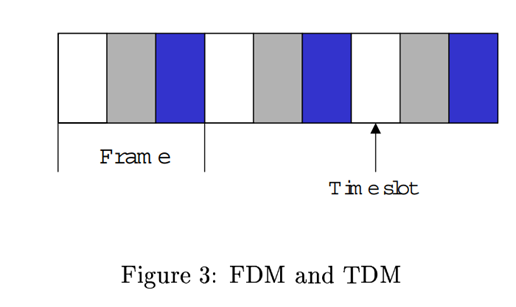

# L2 - Classification of Network Architectures

**Estudiante:** Mariela Solano Gómez  
**Carné:** 2022437963  

---

## Preguntas

### 1. Explique la diferencia entre una WAN y una MAN.

Una WAN abarca grandes áreas geográficas, como países o continentes. Contiene millones de máquinas que están conectadas por subredes de comunicación.  

Por otro lado, una MAN abarca un área geográfica menor, normalmente una ciudad, con un alcance aproximado de hasta 100 km.

**Ejemplos:**
- **WAN:** Internet.  
- **MAN:** Redes de televisión por cable o Internet inalámbrico de alta velocidad.

---

### 2. Explique las diferencias entre una red orientada a conexión y una red no orientada a conexión.

En una **red orientada a conexión**, primero se establece una ruta única antes de transmitir los datos. Esto garantiza que la información enviada desde el emisor llegue al receptor en orden y completa.  

Este tipo de red permite transmisión confiable de datos, control de flujo y control de congestión. Además, utiliza un proceso llamado handshaking, en el cual el emisor y el receptor intercambian información de control antes de comenzar la transmisión, asegurando que la conexión esté correctamente establecida.

En una **red no orientada a conexión**, no existe el procedimiento de handshaking. Cuando un sistema quiere enviar información a otro, simplemente envía los datos sin establecer previamente una conexión.  

Esto permite que la transmisión sea más rápida, pero cada paquete de información debe incluir la dirección del destino, ya que cada uno puede viajar de forma independiente.

---

### 3. ¿Qué es una red punto a punto? Explique cómo implementarla de acuerdo con la lectura.

Una red punto a punto es una arquitectura de red que consiste en múltiples conexiones entre pares individuales de nodos o computadoras. Para que la información llegue desde el origen hasta el destino, los datos pueden viajar a través de varios nodos intermedios, pasando de una máquina a otra hasta alcanzar el destino final.

En este tipo de red pueden existir diferentes rutas entre los nodos, y cuando la transmisión ocurre entre un solo emisor y un solo receptor se denomina unicasting.

De acuerdo con la lectura, existen dos enfoques fundamentales para implementar una red punto a punto:

- **Circuit switching:** se establece previamente un camino dedicado entre el origen y el destino antes de transmitir los datos, reservando los recursos de la red durante toda la comunicación.  
- **Packet switching:** los datos se envían en paquetes y los recursos de la red se utilizan según la demanda, por lo que los paquetes pueden atravesar diferentes rutas dentro de la red.

---

### 4. Explique los conceptos de FDM y TDM.

**FDM (Frequency Division Multiplexing)** es una técnica de multiplexación en la que el ancho de banda de un canal de comunicación se divide en varias bandas de frecuencia más pequeñas. Cada una de estas bandas se asigna a una señal o transmisión diferente, permitiendo que múltiples señales se envíen simultáneamente por el mismo medio físico, pero utilizando diferentes frecuencias.

Este método es común en sistemas como la radio o la televisión por cable.

**TDM (Time Division Multiplexing)** es otra técnica de multiplexación en la que el canal se divide en intervalos de tiempo llamados timeslots. Cada dispositivo o señal transmite durante un pequeño intervalo de tiempo asignado, y luego el canal pasa al siguiente dispositivo.

