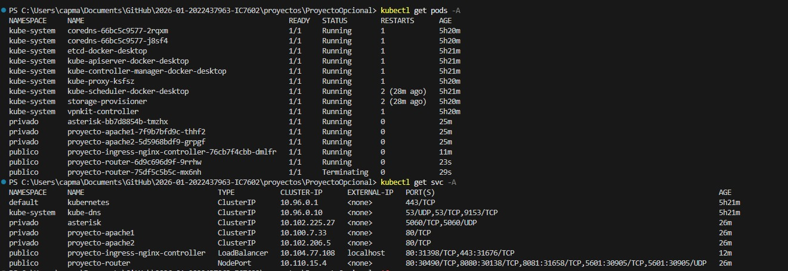
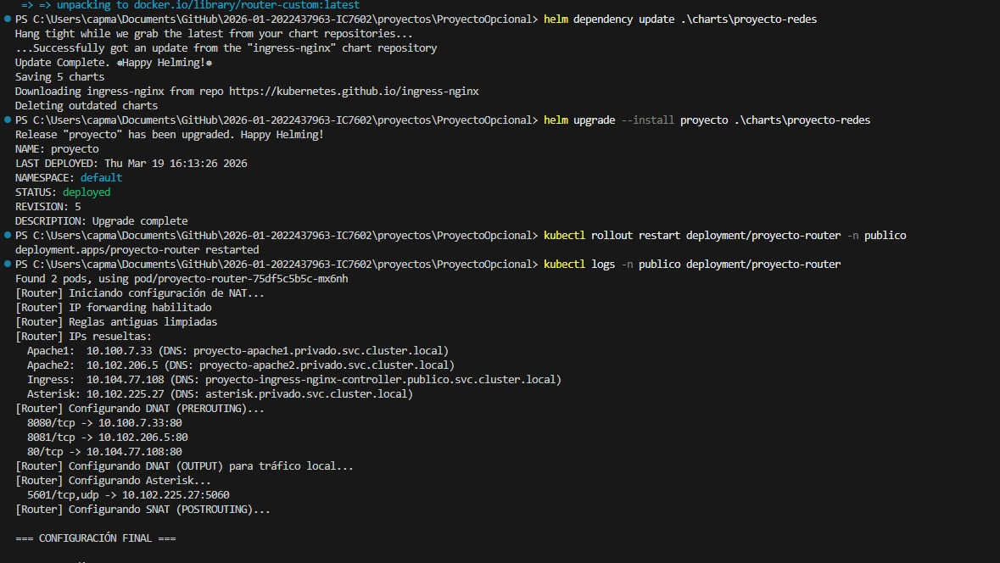
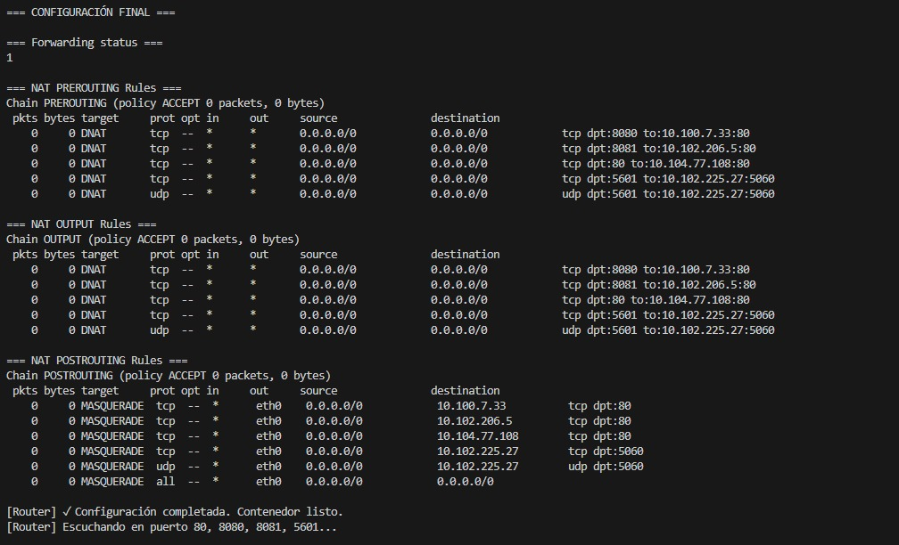
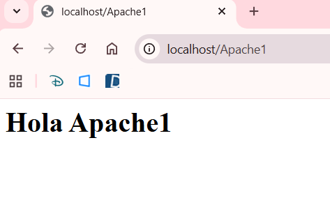
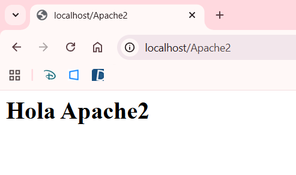
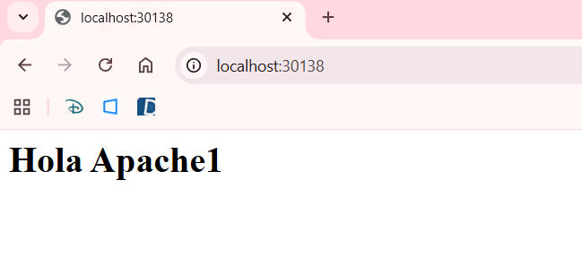
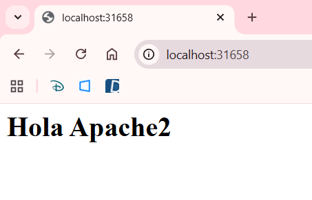
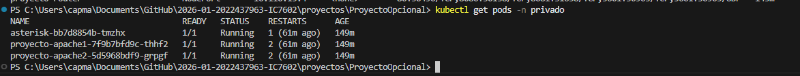
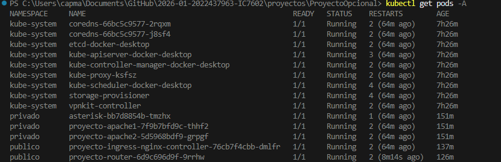

## Automatización de la arquitectura 

### Despliegue automatizado completo

En este sprint se logró automatizar completamente el despliegue de la arquitectura de red utilizando Helm, permitiendo que todos los componentes del sistema se levanten con un solo comando:

```bash
helm install proyecto ./charts/proyecto-redes
```

Este comando realiza automáticamente:

- Creación de namespaces (`publico` y `privado`)
- Despliegue de servicios internos (Apache1, Apache2, Asterisk)
- Despliegue del router con reglas NAT
- Instalación del Ingress Controller (NGINX)
- Configuración del recurso Ingress
- Conectividad entre todos los componentes mediante DNS interno

---

### Arquitectura lograda

Se implementó una arquitectura distribuida basada en separación de redes:

- **Namespace público (`publico`)**
  - Ingress NGINX Controller
  - Router (NAT + enrutamiento)

- **Namespace privado (`privado`)**
  - Apache1 (servidor web)
  - Apache2 (servidor web)
  - Asterisk (servidor SIP)

Esta separación simula un entorno real donde los servicios internos no son accesibles directamente desde el exterior.

---

### Lógica de funcionamiento

El sistema opera de la siguiente manera:

1. El usuario realiza una solicitud HTTP (por ejemplo: `/Apache1`)
2. El Ingress Controller recibe la solicitud
3. El tráfico es dirigido al router
4. El router aplica reglas de NAT (DNAT/SNAT)
5. El router resuelve DNS internos de Kubernetes
6. El tráfico se redirige al servicio correspondiente:
   - Apache1
   - Apache2
   - Asterisk
7. El servicio responde al usuario

---

### Resolución de DNS interno

Uno de los puntos clave del sistema es la resolución de servicios mediante DNS interno de Kubernetes, utilizando nombres como:

- `proyecto-apache1.privado.svc.cluster.local`
- `proyecto-apache2.privado.svc.cluster.local`
- `asterisk.privado.svc.cluster.local`
- `proyecto-ingress-nginx-controller.publico.svc.cluster.local`

Esto permite que los servicios se comuniquen sin depender de direcciones IP fijas.

---

### Configuración del router

El router implementa:

- Habilitación de IP forwarding
- Reglas de NAT:
  - **DNAT** (redirección de tráfico entrante)
  - **SNAT / MASQUERADE** (salida de tráfico)
- Resolución dinámica de servicios mediante DNS
- Exposición de múltiples puertos:
  - 80 → Ingress
  - 8080 → Apache1
  - 8081 → Apache2
  - 5601 → Asterisk

---

### Uso de Helm

Helm permite:

- Definir toda la infraestructura como código
- Gestionar dependencias (incluyendo ingress-nginx)
- Reutilizar configuraciones mediante `values.yaml`
- Automatizar completamente el despliegue

Se utilizaron:

- Chart principal (`proyecto-redes`)
- Subcharts:
  - Apache1
  - Apache2
  - Asterisk
  - Router
  - Ingress NGINX (dependencia)

---

### Problemas técnicos resueltos

Durante la implementación se resolvieron varios retos importantes:

- Integración correcta de `ingress-nginx` como dependencia
- Manejo del prefijo del release (`proyecto-`) en nombres de servicios
- Resolución correcta de DNS interno
- Configuración del router para esperar servicios disponibles
- Evitar errores del webhook de Ingress
- Corrección de nombres de servicios entre router e ingress

---

### Resultado final

Se logró una solución completamente funcional que cumple con:

- Despliegue automático en un solo comando
- Separación clara entre red pública y privada
- Comunicación interna mediante DNS
- Enrutamiento dinámico mediante NAT
- Acceso externo mediante Ingress
- Simulación realista de una arquitectura de red empresarial


---

### Validación

El sistema fue validado mediante:

- Verificación de pods y servicios (`kubectl get pods -A`) y (`kubectl get svc -A`) 



- Revisión de logs del router




- Acceso a servicios vía navegador






- Pruebas de conectividad entre componentes





---

### Conclusión

Se integró todos los componentes del sistema en una solución automatizada, escalable y alineada con prácticas reales de despliegue en entornos cloud y Kubernetes.

El proyecto demuestra el uso efectivo de:

- Orquestación con Kubernetes
- Automatización con Helm
- Segmentación de red
- Enrutamiento y NAT
- Resolución DNS interna


### Comandos principales

A continuación se listan los comandos más importantes utilizados para desplegar, verificar y gestionar el proyecto en Kubernetes.

#### Actualizar dependencias del proyecto

```bash
helm dependency update ./charts/proyecto-redes
```

Descarga e instala las dependencias definidas en el Chart.yaml, incluyendo ingress-nginx y los subcharts del proyecto

#### Actualizar el despliegue

```bash
helm upgrade --install proyecto ./charts/proyecto-redes
```

Reinstala o actualiza el proyecto aplicando cambios en la configuración sin necesidad de borrar todo

#### Desplegar el proyecto

```bash
helm install proyecto ./charts/proyecto-redes
```

Instala toda la arquitectura automáticamente:
- Crea los namespaces (publico, privado)
- Despliega Apache1, Apache2, Asterisk
- Despliega el router
- Instala el Ingress Controller
- Configura el enrutamiento

#### Ver todos los pods

```bash
kubectl get pods -A
```
Muestra todos los pods del clúster, permitiendo verificar si están en estado Running.

#### Ver todos los servicios

```bash
kubectl get svc -A
```

Lista todos los servicios disponibles y sus puertos, incluyendo Apache, Router e Ingress.

#### Eliminar el proyecto

```bash 
helm uninstall proyecto
```

Elimina todos los recursos creados por el proyecto, como pods, services, deployments y demás objetos asociados al release
