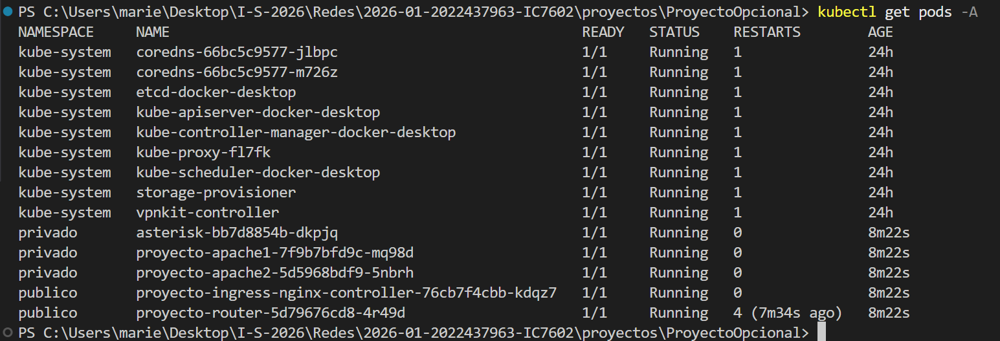
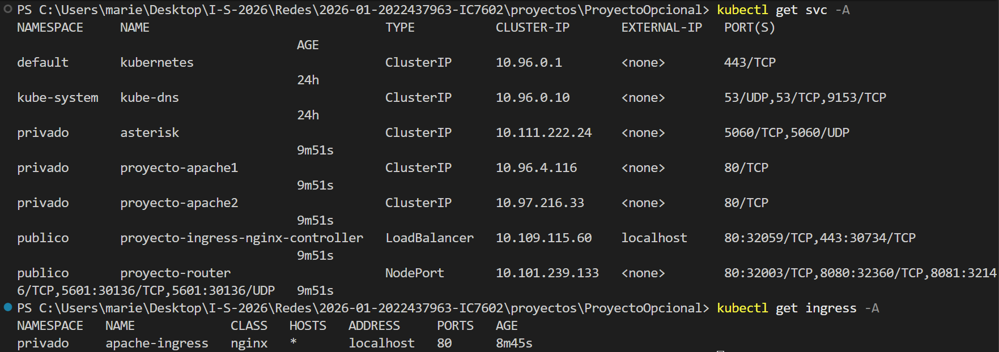
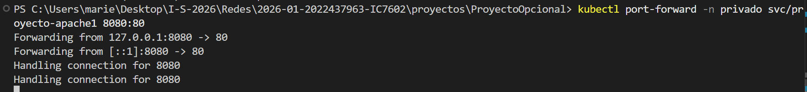
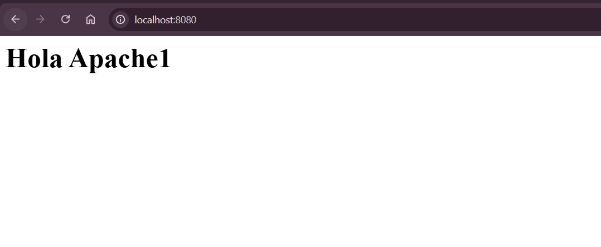
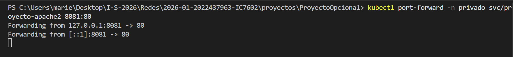
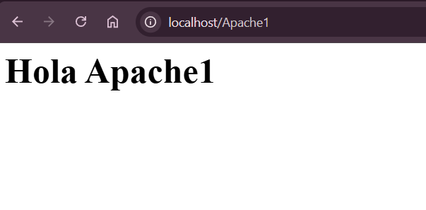
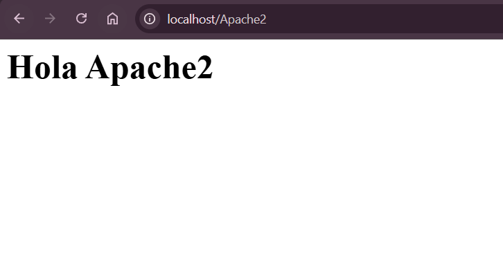
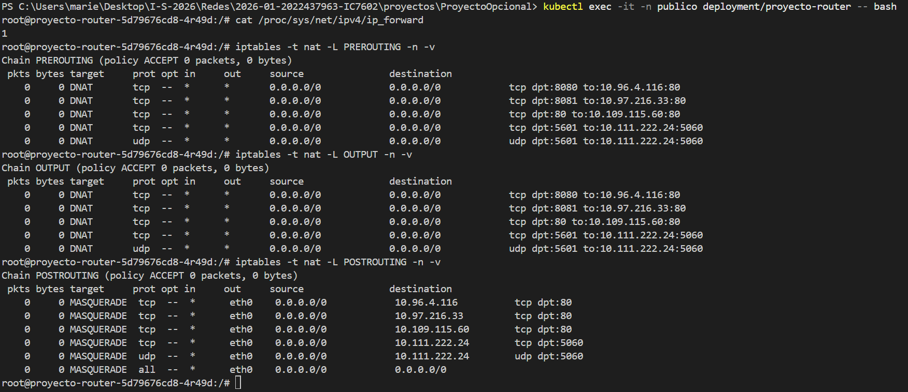

# Proyecto Opcional — IC7602 Redes (2026-01)

**Fecha de entrega:** 19 de marzo de 2026  
**Archivo:** `Documentacion.md`

**Integrantes:**
- Mariela Solano Gómez  
- Alejandra Delgado Pérez  
- Joshua Obando Castro  
- Roilin Navarro Vargas  

## Tabla de contenidos
- [Proyecto Opcional — IC7602 Redes (2026-01)](#proyecto-opcional--ic7602-redes-2026-01)
  - [Tabla de contenidos](#tabla-de-contenidos)
  - [Introducción](#introducción)
  - [Arquitectura requerida](#arquitectura-requerida)
    - [Namespaces](#namespaces)
    - [Flujo esperado](#flujo-esperado)
    - [Despliegue automatizado completo](#despliegue-automatizado-completo)
  - [Requisitos del entorno](#requisitos-del-entorno)
    - [Requisitos mínimos](#requisitos-mínimos)
    - [Herramientas](#herramientas)
    - [Verificación rápida (PowerShell)](#verificación-rápida-powershell)
  - [Estructura del repositorio](#estructura-del-repositorio)
  - [Instalación y ejecución paso a paso](#instalación-y-ejecución-paso-a-paso)
  - [Pruebas realizadas](#pruebas-realizadas)
    - [Prueba 0 — Estado general](#prueba-0--estado-general)
    - [Prueba 1 — Apache1 (port-forward)](#prueba-1--apache1-port-forward)
    - [Prueba 2 — Apache2 (port-forward)](#prueba-2--apache2-port-forward)
    - [Prueba 3 — Ingress por rutas (si el entorno lo permite)](#prueba-3--ingress-por-rutas-si-el-entorno-lo-permite)
    - [Prueba 4 — Router, se hace dentro del cluster](#prueba-4--router-se-hace-dentro-del-cluster)
    - [Prueba 5 — Router: verificación técnica (iptables)](#prueba-5--router-verificación-técnica-iptables)
    - [Prueba 6 — Asterisk: registro de extensión SIP](#prueba-6--asterisk-registro-de-extensión-sip)
    - [Prueba 7 — Asterisk: verificación de extensiones desde el cluster](#prueba-7--asterisk-verificación-de-extensiones-desde-el-cluster)
  - [Problemas encontrados y solución](#problemas-encontrados-y-solución)
  - [Recomendaciones](#recomendaciones)
  - [Conclusiones](#conclusiones)
 

## Introducción

Este proyecto implementa una arquitectura en **Kubernetes** con dos namespaces (`publico` y `privado`) para separar servicios internos y componentes de entrada y salida.

Componentes implementados:
- **Apache1 y Apache2** en `privado` (servicios web internos, Service `ClusterIP`).
- **Ingress Controller NGINX** en `publico` para enrutar por rutas HTTP (`/Apache1`, `/Apache2`).
- **Router (Ubuntu + iptables)** en `publico` para redirección por puertos:
  - `8080` → Apache1
  - `8081` → Apache2
  - `80` → Ingress Controller
  - `5601` TCP/UDP → Asterisk
- **Asterisk** en `privado` como central telefónica VoIP con extensiones SIP configuradas mediante PJSIP.

## Arquitectura requerida

### Namespaces
- `privado`: Apache1, Apache2 y Asterisk.
- `publico`: Ingress Controller y Router.

### Flujo esperado

**1) Acceso web centralizado (HTTP)**
- Cliente → **Router:80** → **Ingress Controller** → Apache1 o Apache2  
- Rutas:
  - `http://<entrada>/Apache1` → Apache1
  - `http://<entrada>/Apache2` → Apache2

**2) Acceso directo por puertos**
- Cliente → **Router:8080** → Apache1  
- Cliente → **Router:8081** → Apache2

**3) Telefonía VoIP**
- Cliente SIP → **Router:5601 TCP/UDP** → **Asterisk:5060** → extensión destino

### Despliegue automatizado completo

```bash
helm install proyecto ./charts/proyecto-redes
```
Este comando realiza automáticamente:

- Creación de namespaces (`publico` y `privado`)
- Despliegue de servicios internos (Apache1, Apache2, Asterisk)
- Despliegue del router con reglas NAT
- Instalación del Ingress Controller (NGINX)
- Configuración del recurso Ingress
- Conectividad entre todos los componentes mediante DNS interno

---

## Requisitos del entorno

Enfocado en **Windows 10 u 11** con **Docker Desktop + WSL2**.

### Requisitos mínimos
- Windows 10/11 (64 bits)
- Virtualización habilitada (BIOS)
- 8 GB RAM mínimo (16 GB recomendado)
- Conexión a internet

### Herramientas
- Docker Desktop (con WSL2)
- Kubernetes habilitado en Docker Desktop
- kubectl
- helm
- git
- Linphone (para pruebas de Asterisk) — descargable en https://www.linphone.org

### Verificación rápida (PowerShell)
```
kubectl config use-context docker-desktop
kubectl get nodes
helm version
docker version
git --version
```

## Estructura del repositorio

```text
proyectos/ProyectoOpcional/
├── k8s/
│   ├── namespaces.yaml
│   └── ingress.yaml
└── charts/
    ├── apache1/
    │   ├── app/ (Dockerfile + index.html)
    │   ├── templates/
    │   ├── Chart.yaml
    │   └── values.yaml
    ├── apache2/
    │   ├── app/ (Dockerfile + index.html)
    │   ├── templates/
    │   ├── Chart.yaml
    │   └── values.yaml
    ├── router/
    │   ├── app/ (Dockerfile + router.sh)
    │   ├── templates/
    │   ├── Chart.yaml
    │   └── values.yaml
    └── asterisk/
        ├── templates/
        │   ├── deployment.yaml
        │   ├── service.yaml
        │   └── configmap.yaml
        ├── Chart.yaml
        └── values.yaml
```

## Instalación y ejecución paso a paso

Ejecutar los comandos desde: `proyectos/ProyectoOpcional`

**1) Confirmar que Kubernetes esté activo**
```bash
kubectl config use-context docker-desktop
kubectl get nodes
# Esperado: 1 nodo Ready.
```

**2) Preparación del entorno**

Antes de desplegar el sistema, es necesario construir las imágenes Docker de los servicios:

```bash
docker build -t apache1-custom:latest ./charts/apache1/app
docker build -t apache2-custom:latest ./charts/apache2/app
docker build -t router-custom:latest ./charts/router/app
```

**3) Despliegue automatizado con Helm**

El despliegue completo del sistema se realiza mediante los siguientes comandos:

```bash
helm dependency build ./charts/proyecto-redes
helm install proyecto ./charts/proyecto-redes
```

**4) Verificar que todos los pods estén corriendo**
```bash
kubectl get pods -A
# Esperado: todos los pods en estado Running
```

## Pruebas realizadas

> Nota importante (Windows + Docker Desktop + kind):  
> A veces los NodePorts no son accesibles desde Windows por temas de red o WSL o Docker.  
> Por eso, las pruebas más reproducibles son **dentro del cluster**.

### Prueba 0 — Estado general
```bash
kubectl get pods -A
kubectl get svc -A
kubectl get ingress -A
```

<p align="center">

</p>

<p align="center">

</p>

### Prueba 1 — Apache1 (port-forward)
```bash
kubectl port-forward -n privado svc/proyecto-apache1 8080:80

# Abrir: http://localhost:8080
# Esperado: Hola Apache1
```

<p align="center">

</p>

<p align="center">

</p>

### Prueba 2 — Apache2 (port-forward)
```bash
kubectl port-forward -n privado svc/proyecto-apache2 8081:80

# Abrir: http://localhost:8081
# Esperado: Hola Apache2
```

<p align="center">

</p>

<p align="center">

</p>

### Prueba 3 — Ingress por rutas (si el entorno lo permite)
```bash
# Probar en el navegador:
http://localhost/Apache1
http://localhost/Apache2

# Esperado:
# /Apache1 → Hola Apache1
# /Apache2 → Hola Apache2
```

<p align="center">

</p>

<p align="center">

</p>

> Si no funciona directo por localhost, usar Prueba 4, la cual se hace dentro del cluster, que es la más confiable.

### Prueba 4 — Router, se hace dentro del cluster

```bash
# 4.1 Crear un pod temporal con curl
kubectl run -it --rm test-curl --image=curlimages/curl -n publico -- sh

# 4.2 Probar redirecciones del router

# Router → Apache1
curl -v http://router.publico.svc.cluster.local:8080/

# Router → Apache2
curl -v http://router.publico.svc.cluster.local:8081/

# Router → Ingress → Apache1
curl -v http://router.publico.svc.cluster.local:80/Apache1

# Router → Ingress → Apache2
curl -v http://router.publico.svc.cluster.local:80/Apache2

# Esperado: HTTP 200 + Hola Apache1/2

# Para salir:
exit
```

### Prueba 5 — Router: verificación técnica (iptables)

```bash
kubectl exec -it -n publico deployment/proyecto-router -- bash

# Dentro del contenedor:
cat /proc/sys/net/ipv4/ip_forward
iptables -t nat -L PREROUTING -n -v
iptables -t nat -L OUTPUT -n -v
iptables -t nat -L POSTROUTING -n -v

exit

# Esperado: reglas DNAT + MASQUERADE e ip_forward = 1
```

<p align="center">

</p>

### Prueba 6 — Asterisk: registro de extensión SIP

Esta prueba verifica que un cliente SIP puede registrarse en la central telefónica Asterisk.

**Requisito:** tener Linphone instalado en la computadora donde se realiza la prueba.

```bash
# Exponer Asterisk localmente mediante port-forward
kubectl port-forward svc/asterisk 5061:5060 -n privado --address 0.0.0.0
```

Luego abrir Linphone y crear una cuenta SIP con los siguientes datos:

| Campo | Valor |
|---|---|
| Usuario | 1001 |
| Dominio SIP | 127.0.0.1:5061 |
| Password | pass1001 |
| Transporte | TCP |

**Esperado:** el indicador de estado en Linphone muestra un círculo verde y la cuenta aparece como registrada.

Para registrar la segunda extensión, repetir el proceso con usuario `1002` y password `pass1002`.

### Prueba 7 — Asterisk: verificación de extensiones desde el cluster

Esta prueba verifica que Asterisk reconoce las extensiones configuradas directamente desde el cluster.

```bash
# Obtener el nombre del pod de Asterisk
kubectl get pods -n privado

# Verificar transportes activos
kubectl exec -it <nombre-del-pod> -n privado -- asterisk -rx "pjsip show transports"
# Esperado: transport-tcp y transport-udp en 0.0.0.0:5060

# Verificar extensiones registradas
kubectl exec -it <nombre-del-pod> -n privado -- asterisk -rx "pjsip show endpoints"
# Esperado: endpoint 1001 y 1002 visibles
# Cuando Linphone está conectado, el endpoint muestra "Not in use" en lugar de "Unavailable"
```

---

## Problemas encontrados y solución

**Problema 1: Ingress en namespace incorrecto**
- Qué pasaba: `services "apache1" not found`
- Causa: Ingress creado en `publico`, pero Apache está en `privado`
- Solución: el Ingress debe estar en `privado`

**Problema 2: "Not Found" al usar `/Apache1` o `/Apache2`**
- Causa: Apache recibe la ruta completa `/Apache1`, pero el sitio está en `/`
- Solución: usar rewrite con:
  - `nginx.ingress.kubernetes.io/use-regex`
  - `nginx.ingress.kubernetes.io/rewrite-target`

**Problema 3: NodePort inaccesible desde Windows (Docker Desktop + kind)**
- Qué pasaba: `curl http://127.0.0.1:<nodePort>` falla
- Causa: aislamiento de red Windows → WSL2 → Docker Desktop → red interna kind
- Solución: pruebas dentro del cluster (Prueba 4) y evidencias con `kubectl describe svc`

**Problema 4: La imagen de Asterisk ignoraba el ConfigMap de pjsip.conf**
- Qué pasaba: Asterisk arrancaba pero los transportes SIP no estaban disponibles
- Causa: la imagen `andrius/asterisk` trae su propio `pjsip.conf` que sobreescribía el ConfigMap montado
- Solución: se agregó un `initContainer` que primero copia todos los archivos originales de configuración a un volumen compartido y luego sobreescribe únicamente `pjsip.conf` y `extensions.conf` con los archivos del ConfigMap. Así Asterisk arranca con todos los archivos que necesita pero con nuestra configuración aplicada

**Problema 5: Conflicto de puertos entre Linphone y kubectl port-forward**
- Qué pasaba: Linphone y el port-forward competían por el puerto 5060 UDP/TCP en la misma máquina
- Causa: Linphone ocupa el puerto 5060 UDP localmente al arrancar
- Solución: cambiar el port-forward para usar el puerto 5061 en el host (`5061:5060`) y configurar Linphone para conectarse a `127.0.0.1:5061`

---

## Recomendaciones

1. Hacer un "Quickstart" corto y luego el detalle, para que el profesor lo ejecute rápido.
2. Probar Apache (interno) antes de Ingress y Router, así se depura por capas.
3. Usar `helm upgrade --install` para reinstalar sin pelearse con "ya existe".
4. No ejecutar `helm create` sobre charts ya modificados (puede sobreescribir y perder cambios).
5. Mantener `imagePullPolicy: IfNotPresent` cuando se usan imágenes locales.
6. Siempre validar con `kubectl get`, `kubectl describe` y `kubectl logs`.
7. Separar componentes en namespaces mejora orden y seguridad.
8. Documentar el "por qué" de decisiones (rewrite, pruebas dentro del cluster).
9. Para debug, usar `kubectl exec` + `iptables` + un pod temporal con `curl`.
10. Tener comandos de limpieza para reiniciar el ambiente si algo se rompe.
11. Usar pruebas reproducibles con "resultado esperado" claro.
12. Guardar evidencias (capturas/salidas) de las pruebas principales.
13. Para servicios como Asterisk que traen configuración por defecto en su imagen, usar un `initContainer` es una forma confiable de garantizar que nuestra configuración se aplique correctamente.
14. Cuando se trabaja con protocolos que usan puertos fijos como SIP (5060), verificar que no haya conflictos con otros servicios corriendo en la misma máquina antes de hacer pruebas.

---

## Conclusiones

1. Kubernetes permite separar componentes claramente usando namespaces.
2. `ClusterIP` es ideal para servicios internos (Apache y Asterisk en `privado`).
3. Ingress Controller resuelve enrutamiento HTTP por rutas (L7).
4. El rewrite es necesario cuando el backend no espera prefijos como `/Apache1`.
5. Un router con iptables permite redirecciones por puertos (L4) sin depender de HTTP.
6. iptables requiere permisos especiales (`NET_ADMIN`/`privileged`) dentro del contenedor.
7. Docker Desktop + kind en Windows puede limitar acceso a NodePort desde el host.
8. Probar desde dentro del cluster es una forma consistente y reproducible de validar redirecciones.
9. Helm ayuda a automatizar despliegues y reinstalaciones de manera ordenada.
10. La documentación y pruebas reproducibles son clave para la evaluación, no solo el código.
11. La arquitectura es ampliable: se pueden sumar más servicios sin rehacer todo.
12. Entender PREROUTING/OUTPUT/POSTROUTING facilita depurar problemas de NAT.
13. El protocolo PJSIP es el estándar moderno en Asterisk para gestionar comunicaciones SIP, reemplazando al antiguo `chan_sip`. Es más flexible y permite configurar transportes TCP y UDP de forma independiente.
14. Usar `initContainers` en Kubernetes es una solución elegante para preparar el entorno de un contenedor antes de que arranque, especialmente cuando la imagen base trae configuración por defecto que necesita ser sobreescrita.
